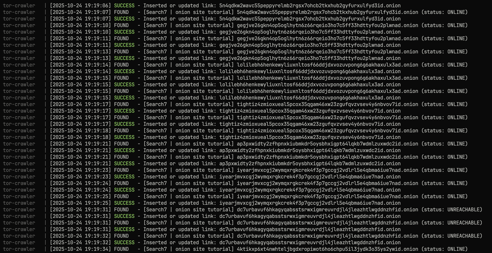

# BOA Tor Crawler 🕵️‍♂️  
<p align="center">
  
</p>
<p align="center">
  <a href="https://github.com/JetBerri/boa-tor-crawler/stargazers">
    
  </a>
  <a href="https://github.com/JetBerri/boa-tor-crawler/issues">
    
  </a>
  <a href="LICENSE">
    
  </a>
</p>


## Overview 
**BOA Tor Crawler** is a full-stack, Docker-based crawler designed to discover `.onion` hidden-service links via the Tor network, validate their online status, extract results into a PostgreSQL database, and support large-scale data analysis of dark web ecosystems.  

Here's an example of the performing of the crawler, from my testing it can obtain +50 working onion sites in over a minute.

<p align="center">
  
</p>

### Key features  
- Uses `tor-proxy` container to route all crawler traffic through Tor (`socks5h://tor-proxy:9050`)  
- Stores all discovered `.onion` links in PostgreSQL (`tor-postgres`) with query, engine source, status and timestamp  
- Written in **C** for high performance (uses `libcurl`, `libyaml`, and `libpq`)  
- Fully containerized via **Docker Compose** for simple deployment, isolation, and reproducibility  

---

## ⚙️ Install & Run

Follow these simple steps to download, build, and launch **BOA Tor Crawler** using Docker.

---

### 1. Install Docker & Compose
```
sudo apt update && sudo apt install -y docker.io docker-compose
sudo systemctl enable --now docker
```

---

### 2. Clone the repository
```
git clone https://github.com/JetBerri/boa-tor-crawler.git
cd boa-tor-crawler
```

---

### 3. Build the stack
```
docker compose build
```

---

### 4. Run the system
```
docker compose up -d
```

This starts:
- **tor-proxy** → Tor network relay  
- **tor-postgres** → Database  
- **tor-crawler** → Main crawler process  

---

### 5. View logs
```
docker compose logs -f crawler
```  
or  
```
tail -f logs/crawler_$(date +%Y-%m-%d).log
```

---

### 6. Inspect results
```
docker exec -it tor-postgres psql -U crawler -d torcrawl
SELECT COUNT(*), status FROM onion_links GROUP BY status;
```

---

### 7. Manage the crawler
```
docker compose stop crawler     # stop only crawler  
docker compose restart crawler  # restart it  
docker compose down             # stop everything
```

---

✅ You’re done!  
BOA Tor Crawler will now scan `.onion` search engines, store links, and log activity safely inside Docker

## Architecture

Each component runs inside its own container:
```
 ┌─────────────────────────────┐  
 │ tor-proxy (Tor daemon)      │ → All traffic routed through Tor  
 └─────────────────────────────┘  
               │  
               ↓  
 ┌─────────────────────────────┐  
 │ tor-crawler (main binary)   │ → Performs crawling, parsing, link validation  
 └─────────────────────────────┘  
               │  
               ↓  
 ┌─────────────────────────────┐  
 │ tor-postgres (PostgreSQL)   │ → Stores URLs, queries, engines, and statuses  
 └─────────────────────────────┘  
```

## Deployment Guide

### Prerequisites  
- Docker and Docker Compose installed  
- Linux or macOS system (recommended)  
- At least moderate bandwidth — Tor network connections are slower by nature  

### Clone the repository  
``` git clone https://github.com/JetBerri/boa-tor-crawler.git ```
```cd boa-tor-crawler ```

### Build and start the crawler system  
``` docker compose up -d ```  

This will automatically:
- Build the C-based crawler binary
- Start a Tor proxy container (`tor-proxy`)
- Start a PostgreSQL database container (`tor-postgres`)
- Launch the crawler, which will read `config/engines.yaml` and `config/queries.txt`

---

## Managing the crawler

### Stop the crawler  
``` docker compose stop crawler ```  

### Restart the crawler  
``` docker compose restart crawler ```  

### Rebuild the crawler binary (after making code changes)  
``` docker compose build crawler```  
```docker compose up -d crawler ```  

### View crawler logs  
``` docker compose logs -f crawler ```  

Or, for local file logs:  
``` tail -f logs/crawler_$(date +%Y-%m-%d).log ```  

---

## Database Interaction

### Enter the PostgreSQL container  
``` docker exec -it tor-postgres psql -U crawler -d torcrawl ```  

### Show last 10 discovered links  
``` SELECT * FROM onion_links ORDER BY id DESC LIMIT 10; ```  

### Count total URLs by status  
``` SELECT status, COUNT(*) FROM onion_links GROUP BY status ORDER BY COUNT(*) DESC; ```  

---

## Configuration files

### config/engines.yaml  
Defines the search engines to query. Example:  
```
engines:
  - name: Browser 1
    url: "browser1.onion/search/?q=%s"

  - name: Browser 2
    url: "browser2.onion/search?query=%s&action=search"
```

### config/queries.txt  
Contains queries (one per line):  
```
privacy tools  
bitcoin mixer  
darknet markets  
cryptocurrency  
```

---

## Logging  
The crawler generates daily log files in `logs/`:  
``` logs/crawler_YYYY-MM-DD.log ```  

View logs live:  
``` tail -f logs/crawler_$(date +%Y-%m-%d).log ```  

---

## Contributing  
Pull requests and improvements are welcome!  
Before contributing:
- Test locally (`make clean && make`)
- Run `docker compose build && docker compose up -d crawler`
- Keep configuration files consistent and minimal

---

## License  
Distributed under the MIT License.  
See `LICENSE` for more information.

---

**Developed with 🕶️ by JetBerri**  
Repository: [https://github.com/JetBerri/boa-tor-crawler](https://github.com/JetBerri/boa-tor-crawler)
